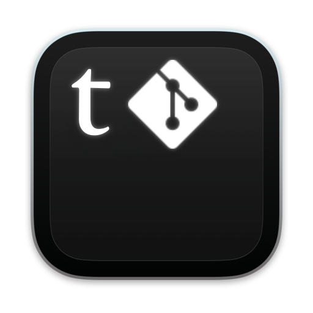

<div align="center">

<h1>tgit</h1>
</div>


A convenient, feature-rich git terminal (TUI) with mouse support, GitHub-token sign-in,
and the long-term goal of closing most of git's everyday friction (see [INTERFACE.md](INTERFACE.md) —
the full description of the intended interface; only part of it is implemented in code so far).

## Requirements

- **Go 1.24+** (builds on any OS — the build is cross-platform, no cgo)
- **git**, installed and available on `PATH` (tgit shells out to the system git instead of reimplementing it)
- A terminal with mouse support and, ideally, clickable links (OSC8) — iTerm2, Kitty, WezTerm,
  Windows Terminal, GNOME Terminal, a modern macOS Terminal.app. Everything else works fine in
  other terminals too, the link on the login screen just won't be clickable and has to be copied manually.

## One-command install

### Linux/macOS — `install.sh`

```sh
./install.sh
```

The script checks for `git` and the required `Go` version itself, builds tgit, and places the
binary at `~/.local/bin/tgit` — after that the `tgit` command is available in your terminal (if
that directory isn't on `PATH`, the script prints the line to add to your shell config).

Options:

```sh
./install.sh --system         # install into /usr/local/bin (will ask for sudo)
./install.sh --prefix=DIR     # install into an arbitrary directory
./install.sh --help
```

### Windows — `install.ps1`

```powershell
.\install.ps1 -AddToPath
```

Checks for `git` and the required `Go` version, builds `tgit.exe`, and places it at
`%LOCALAPPDATA%\Programs\tgit` (no administrator rights needed). The `-AddToPath` flag
immediately adds that directory to the current user's PATH (registry, HKCU) — without it the
script only prints the command for adding it manually.

```powershell
.\install.ps1                                # build only, don't touch PATH
.\install.ps1 -Prefix 'C:\tools\tgit' -AddToPath
.\install.ps1 -?                              # help (Get-Help)
```

If running `.ps1` files is blocked by execution policy:

```powershell
powershell -ExecutionPolicy Bypass -File install.ps1 -AddToPath
```

### Missing dependencies

If `git` or `Go` aren't found, both scripts stop and print the install command for your OS
(`winget`/`choco` on Windows, `brew`/`apt`/`dnf`/`pacman` on Linux/macOS).

## Building manually

From the repository root:

```sh
go build -o bin/tgit .
```

Or via the Makefile (same thing, for the current platform):

```sh
make build
```

The binary lands at `bin/tgit` (`bin\tgit.exe` when built on Windows).

### Cross-compiling for all platforms at once

```sh
make cross
```

Builds binaries for Linux, macOS, and Windows (amd64 and arm64) into `dist/`:

```
dist/tgit-linux-amd64
dist/tgit-linux-arm64
dist/tgit-darwin-amd64
dist/tgit-darwin-arm64
dist/tgit-windows-amd64.exe
```

Cross-compilation works from any host OS (Go sets the right `GOOS`/`GOARCH` for you) — you don't
need to build on the target machine itself.

## Running tgit

After `./install.sh` — just run `tgit` inside the git repository you want to work on.

Without installing, straight from the built binary:

```sh
./bin/tgit
```

(On Windows: `bin\tgit.exe`.)

`tgit --version` prints the version and exits without starting the TUI — handy for checking
that the install succeeded.

## First run and signing in with GitHub

On the very first run, tgit shows a language-select screen: pick English or Russian for the
interface (`↑`/`↓`, `Enter`) before anything else appears.

Then, if no token has been saved yet, tgit shows the login screen with a link to create a
Personal Access Token:

```
https://github.com/settings/tokens/new?description=tgit-cli&scopes=repo,read:user
```

- Click the link (if your terminal supports it) or press `Ctrl+O` — this opens your browser.
- Create a token with the `repo` scope, copy it, and paste it into the input field.
- `Enter` — the token is verified against the GitHub API and saved to the system secret store
  (Keychain on macOS, Credential Manager on Windows, Secret Service/dbus on Linux; if that's
  unavailable — a config file with `0600` permissions).
- `Esc` — skip sign-in and work locally: GitHub isn't required for basic git operations, you
  can sign in later with `g`.

## Running outside a git repository

If the current folder has no `.git`, tgit shows a list of recently opened projects instead of
the main screen, and offers to clone a repository right into it:

- `↑`/`↓`, `Enter` — open one of the recent tgit projects (the list is stored at
  `~/.config/tgit/recent.json`, updated automatically on every successful run inside a
  git repository).
- `c` — enter a URL and clone a repository into the current folder (`Enter` — clone,
  `Esc` — cancel).

After successfully opening or cloning, tgit switches straight to the main screen for that
repository.

## Main screen

Four panels: **Branches**, **Files** (staged/unstaged/untracked), commit **Log**, and the
**Diff** of the selected file or commit. `Tab`/`Shift+Tab` switches panels, `↑`/`↓` (or
`j`/`k`) navigate within one; in the Diff panel this scrolls the content.

The full list of keybindings across every screen and modal is in [KEYBINDINGS.md](KEYBINDINGS.md).
Below is a summary for the main screen.

| Key         | Action                                                             |
|-------------|-------------------------------------------------------------------|
| `Tab`       | next panel (Branches → Files → Log → Diff)                        |
| `↑`/`↓`, `j`/`k` | navigate the active panel / scroll the diff                  |
| `space`     | stage / unstage the file under the cursor                         |
| `enter`     | in Files — same as space; in Branches — checkout the selected branch |
| `c`         | new commit (needs staged files) — opens the message input         |
| `b`         | branch switcher: filter by substring, `enter` — checkout, or create and switch to a new branch if there's no match |
| `p` / `P`   | push / pull (uses the saved GitHub token for HTTPS repositories on github.com) |
| `f`         | fetch --all                                                        |
| `s`         | **Stash** — list of stashes with a preview of changed files; `n` — new stash, `enter`/`p` — pop (apply and remove), `a` — apply (keep in stash), `x` — drop (delete permanently, with confirmation) |
| `S`         | quick pop of the latest stash, without opening the Stash panel     |
| `d`         | **Doctor** — scans the repository (currently: macOS junk files `._*`/`.DS_Store`, un-ignored `node_modules`/`__pycache__`/`.venv`/...) and fixes them on confirmation |
| `y`         | in the Log — copy the full commit hash to the clipboard            |
| `r`         | refresh repository data                                            |
| `g`         | sign in to GitHub / change token (unavailable inside other dialogs) |
| `Ctrl+C`    | quit                                                               |

In every dialog (commit, branch switcher, Doctor, Stash) — `Esc` cancels and returns to the
main screen.

## Mouse

Works in any terminal with SGR/X10 mouse reporting support (all terminals listed in the
"Requirements" section) the same way on Linux, macOS, and Windows:

- **clicking a panel** — moves focus to it; clicking a row in Branches/Files/Log —
  selects that exact row (equivalent to `↑`/`↓`, the action itself still happens via `space`/`enter` as usual);
- **clicking a toolbar button** — does the same thing as its hotkey;
- **mouse wheel** — scrolls the panel under the cursor (not necessarily the one focused via
  keyboard) — same in modal lists (branch switcher, Doctor, Stash);
- in modals with a list (branch switcher, Doctor, Stash) clicking a row also selects it.

A click only ever selects — destructive actions (checkout, commit, drop) still require the
explicit key, so an accidental click never triggers them.

## Development

```sh
go vet ./...      # static analysis
go build ./...    # build all packages
```

Project structure:

```
install.sh                — installer for Linux/macOS: dependency checks, build, PATH
install.ps1               — the same for Windows (PowerShell)
KEYBINDINGS.md            — full list of hotkeys across every screen
main.go                  — entry point
internal/gitrepo/        — wrapper around the system git (status, branches, log, diff, commit, push/pull/fetch, stash)
internal/doctor/         — "Git Doctor" rules and their auto-fixes
internal/ghauth/         — GitHub token validation, link to create one
internal/secret/         — cross-platform token storage
internal/openurl/        — opening a link in the default browser
internal/i18n/           — interface language strings (English/Russian) and the active-language switch
internal/ui/              — Bubble Tea screens (login, main screen, panels, modals, styles)
```
